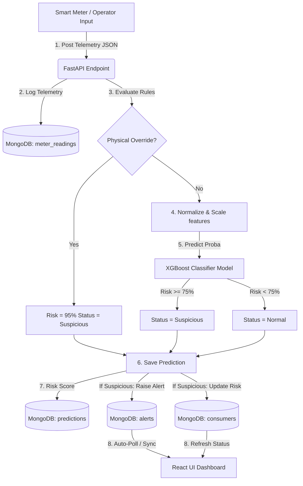

# Project Blueprint: AI-Based Power Theft Detection in Electrical Systems

This document serves as the complete technical blueprint for **GridGuardian**, explaining the system's operational design, mathematical foundations, machine learning mechanics (XGBoost), and database schemas. Any developer, grid engineer, or auditor reading this guide will understand exactly how the system works without looking at the source code.

---

## 1. Executive Summary & Problem Statement

Power theft (non-technical losses) is a critical issue for electricity distribution companies worldwide, resulting in billions of dollars in revenue losses annually. Theft typically happens through three methods:
1. **Line Bypass**: Connecting wires directly to the distribution lines before the electricity enters the meter.
2. **Meter Tampering**: Using magnets, shunt resistors, or neutral line disruptions to slow down the meter dials.
3. **Billing Fraud**: Tampering with cumulative reading logs.

GridGuardian solves this problem by collecting electrical parameters (Voltage, Current, Power Factor, Peak Load, and Consumption rates) from consumer smart meters and passing them through a **Hybrid AI Engine** (combining **XGBoost Machine Learning** with **hard physical override checks**) to flag suspicious nodes in real-time.

---

## 2. Electrical Mathematics & Physics Foundations

Smart meters measure several variables. In electrical engineering, we analyze alternating current (AC) circuits using the following relationships:

### A. Apparent Power ($S$)
Apparent power is the total power flowing in a circuit. It is measured in Volt-Amperes (VA):
$$S = V \times I$$
Where:
* $V$ = Root Mean Square (RMS) Voltage in Volts (V)
* $I$ = Root Mean Square (RMS) Current in Amperes (A)

### B. Active Power ($P$)
Active power is the actual real power used by the consumer to perform work (e.g. heating, lighting, running motors). It is measured in Watts (W) or Kilowatts (kW):
$$P = V \times I \times PF$$
Where:
* $PF$ = **Power Factor** ($\cos \theta$). This is the ratio of real power to apparent power ($P/S$), ranging from $0.0$ to $1.0$.

### C. Calculated Energy Consumption ($E_{\text{calculated}}$)
Energy consumption represents active power used over time. It is measured in Kilowatt-hours (kWh):
$$E_{\text{calculated}} = \frac{P \times t}{1000} = \frac{V \times I \times PF \times t}{1000}$$
Where:
* $t$ = Duration of the measurement interval in hours (e.g. $1\text{ hour}$).

### D. The Math Mismatch Anomaly (Theft Signature)
Under normal operations, the reported consumption ($E_{\text{reported}}$) from the meter should closely match the calculated energy:
$$E_{\text{reported}} \approx E_{\text{calculated}}$$

In a **Line Bypass Theft**, current $I$ continues to flow through the customer's appliances, but they hook a wire before the meter's current sensor. This results in the meter reporting:
$$E_{\text{reported}} \approx 0 \quad \text{while} \quad I > 5.0\text{ A}$$
This mathematical discrepancy ($E_{\text{reported}} \ll E_{\text{calculated}}$) is the primary physical signature of power theft.

---

## 3. System Architecture & Component Interactions



### The Ingestion and Prediction Loop
1. **Ingestion**: Telemetry values are posted via HTTP requests to `/api/readings/predict`.
2. **Bypass Check**: The backend evaluates the payload against hard physical rules. If a rule triggers, it skips the ML model, flags `"Suspicious"`, and issues a `95%` risk score.
3. **ML Evaluation**: If the reading passes the bypass checks, the variables are scaled and sent to the XGBoost model.
4. **Alarms Trigger**: If the resulting risk score $\ge 75\%$:
   - An alert is inserted into the `alerts` collection.
   - The consumer's registry category is set to `Suspicious`.
5. **Dashboard Render**: The React UI polls the server, adding the alert to the operator's active feed and plotting the anomaly spike on the timeline chart.

---

## 4. Machine Learning Engine: XGBoost

GridGuardian utilizes **XGBoost (eXtreme Gradient Boosting)**, an optimized implementation of the Gradient Boosted Decision Tree (GBDT) algorithm, as its primary classification model.

### A. How Gradient Boosting Works
Gradient boosting is an ensemble technique where multiple weak predictors (decision trees) are trained sequentially. Each new tree corrects the errors made by the previous trees:
$$\hat{y}_i^{(t)} = \hat{y}_i^{(t-1)} + f_t(x_i)$$
Where:
* $\hat{y}_i^{(t)}$ = Prediction for sample $i$ at iteration $t$.
* $f_t(x_i)$ = The new decision tree trained at iteration $t$.

### B. Mathematical Objective Function
To determine the optimal parameters of each new tree, XGBoost minimizes a regularized objective function:
$$\mathcal{L}^{(t)} = \sum_{i=1}^{n} l\left(y_i, \hat{y}_i^{(t-1)} + f_t(x_i)\right) + \Omega(f_t)$$
Where:
* $l(y_i, \hat{y}_i)$ = Loss function measuring the difference between the true label $y_i$ ($0$ or $1$) and the prediction $\hat{y}_i$.
* $\Omega(f_t)$ = Regularization term that penalizes the complexity of the tree to prevent overfitting:
$$\Omega(f_t) = \gamma T + \frac{1}{2}\lambda \sum_{j=1}^{T} w_j^2$$
* $T$ = Number of leaves in the decision tree.
* $w_j$ = Leaf weights (scores).
* $\gamma, \lambda$ = Regularization constants controlling tree depth and weight magnitude.

### C. Feature Preprocessing & Standardization
Before entering the decision trees, features must be scaled because electrical metrics have vastly different magnitudes (e.g. cumulative reading can be `10000`, while power factor is `0.95`). We use **Z-Score Standardization**:
$$z = \frac{x - \mu}{\sigma}$$
Where:
* $x$ = Original feature value.
* $\mu$ = Feature mean calculated from the training set.
* $\sigma$ = Feature standard deviation.

This maps all inputs to have a mean of $0$ and a standard deviation of $1$, ensuring stable model performance.

---

## 5. Hybrid AI: Physical Override Rules

If the training dataset is synthetic or contains statistical noise, the machine learning model might fail to detect obvious theft. GridGuardian implements **Physical Override Rules** to act as a fallback safety net:

```text
Inputs: Voltage (V), Current (A), Power Factor (PF), Energy Consumption (E), Anomaly Score (A)

Is A > 75?
  ├── Yes ──► Status: Suspicious (Risk = 88%)  [Tampering Detected]
  └── No
       │
       └── Is Current > 5.0A AND Energy < 0.01 kWh?
             ├── Yes ──► Status: Suspicious (Risk = 95%)  [Line Bypass Detected]
             └── No
                  │
                  └── Is Voltage < 160V AND Current > 15A?
                        ├── Yes ──► Status: Suspicious (Risk = 82%)  [Earth Bypass/Tampering]
                        └── No  ──► Pass to XGBoost Classifier Model
```

---

## 6. Database Schema Design (MongoDB Document Models)

MongoDB stores data as BSON documents. Below are the logical schemas for our collections:

### A. `users` Collection (Authentication)
Tracks utility operators authorized to use the system.
```json
{
  "_id": "ObjectId",
  "username": "operator_steve",
  "email": "steve@gridsecurity.com",
  "hashed_password": "$2b$12$...",
  "role": "operator",
  "created_at": "ISODate"
}
```

### B. `consumers` Collection (Nodes Registry)
Stores consumer profiles and their risk status.
```json
{
  "_id": "ObjectId",
  "consumer_number": "2003004005",
  "name": "Robert Henderson",
  "address": "Apt 4B, 742 Evergreen Terrace",
  "meter_serial_number": "MTR-HOME-99",
  "risk_category": "Normal", // "Normal" or "Suspicious"
  "created_at": "ISODate"
}
```

### C. `meter_readings` Collection (Telemetry History)
Logs raw data reported by smart meters.
```json
{
  "_id": "ObjectId",
  "consumer_id": "6a32dc93c2...", // Reference to consumers._id
  "voltage_v": 220.0,
  "current_a": 32.0,
  "power_factor": 0.95,
  "energy_consumption_kwh": 0.001,
  "peak_load_kw": 7.0,
  "hour_of_day": 14,
  "meter_reading_kwh": 5000.0,
  "anomaly_score": 85.0,
  "timestamp": "ISODate"
}
```

### D. `predictions` Collection (AI Classifications Log)
Logs the output of the prediction pipeline.
```json
{
  "_id": "ObjectId",
  "reading_id": "7f13cb24e3...", // Reference to meter_readings._id
  "consumer_id": "6a32dc93c2...",
  "risk_score": 0.95,
  "status": "Suspicious", // "Normal" or "Suspicious"
  "timestamp": "ISODate"
}
```

### E. `alerts` Collection (Grid Incident Tickets)
Manages the workflow of unresolved anomalies.
```json
{
  "_id": "ObjectId",
  "prediction_id": "9d24cc15f4...", // Reference to predictions._id
  "consumer_id": "6a32dc93c2...",
  "risk_score": 0.95,
  "status": "Active", // "Active" or "Resolved"
  "created_at": "ISODate",
  "resolved_at": null, // Updates to ISODate when resolved
  "resolved_by": null  // Updates to operator username when resolved
}
```

---

## 7. Operator Workflow & Lifecycle Management

The system follows a closed-loop security lifecycle:

```text
 1. REGISTRATION ──►  2. TELEMETRY  ──►  3. DETECTION ──►  4. ACTION ──►  5. RESOLUTION
 (Add Consumer)       (Meter streams     (AI flags        (Inspect &     (Reset alert &
                      values)            theft)           fix grid)      consumer state)
```

1. **Registration**: An operator adds a consumer profile.
2. **Regular Telemetry**: The consumer draws power normally. Telemetry reports balanced values. The system remains green (`Normal`).
3. **Theft Incident**: The consumer installs a bypass wire. Telemetry reports high current but low consumption.
4. **Detection Alert**: The system triggers a physical bypass override, registers a `Suspicious` status, writes an active alert document, and updates the consumer to a warning state.
5. **Action**: The operator sees the Critical alert on their dashboard feed, dispatches technicians to remove the bypass hook, and secures the smart meter.
6. **Resolution**: The operator clicks "Resolve Alert" on their dashboard. The backend updates the alert status to `Resolved` and resets the consumer status back to `Normal`, logging the operator's name for auditing.
